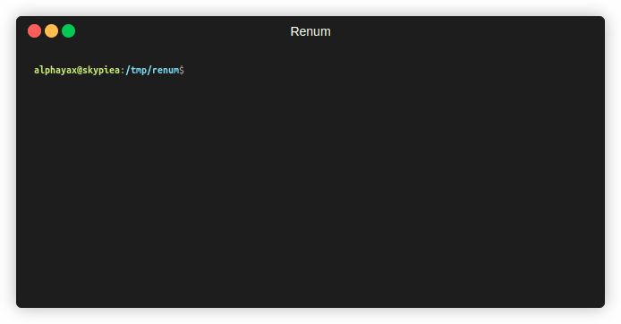

# Renum

[](https://github.com/alphayax/renum/releases/latest)
[](https://github.com/alphayax/renum/actions/workflows/test.yml)
[](https://goreportcard.com/report/github.com/alphayax/renum)

Renum is a simple and efficient tool written in Go, designed to rename and renumber files in a directory. It's particularly useful for renaming series of files with a specific pattern.



## Features
- Rename files in a directory based on a specific pattern.
- Preview the changes before applying them.
- Never overwrites a file: a batch that would destroy data is refused upfront.
- Easy to use with a simple command line interface.


## Installation

### Using pre-built Packages
`renum` is available for Windows, Linux and macOS. You can download the latest version from the [releases page](https://github.com/alphayax/renum/releases).

### Using Go
To install Renum, you need to have Go installed on your machine. Once you have Go installed, you can download and install Renum using the `go get` command:

```bash
go install github.com/alphayax/renum@latest
```

### Using Docker
You can also use Renum with Docker. To do so, you can run the following command:

```bash
docker run --rm -it -v /path/to/directory:/data alphayax/renum:latest [options] /data
```


## Usage
To use Renum, run the following command by passing the path to the directory containing the files you want to rename as last argument:
```bash
renum [options] /path/to/directory
```

### Options
- `-s <NUM>`, `--season <NUM>`: The season number to use.
- `-e <NUM>`, `--episode <NUM>`: The episode number to start from. Will be incremented for each file.
- `-h`, `--help`: Display the help message.
- `--force`: Don't ask for confirmation before applying the changes.
- `--verbose`: Increase logs verbosity.
- `--json`: Display logs in JSON format.
- `--dry-run`: Preview the changes without applying them.
- `--pattern <REGEX>`: Use a custom file pattern. (Will replace all the default file pattern detected)

### Default filename patterns detected
- `S[0-9]+E[0-9]+`: containing `S1E01` or `S01E01`.
- ` [0-9]{1,2}x[0-9]+ `: containing ` 1x01 ` or ` 01x01 `.
- `^E[0-9]+`: starting by `E01` or `E001`...
- `([_ ])[0-9]+([_ .])`: containing `_01_` or `_001_` or `_0001_` or ` 01 ` or `001`...
  The separators around the number are kept as they were, so the extension of
  `serie 1.mkv` survives.

Only the first occurrence found in a name is renumbered: a name carries a single
episode number, so in `S01E01 - rerun of S01E01.mkv` the second one is part of
the title and is left as it is.

> You can use your own file pattern detection by using the `--pattern` flag with your custom regex.
> For example: `--pattern "Season.[0-9]+.Ep.[0-9]+"` to match "Season 4 Ep 21"


### Episode numbering
Files are grouped into episodes by their name without the extension, and all the
files of one episode get the same number. A video and its subtitle therefore stay
together:

```
Show S01E01.mkv     ->  Show S02E01.mkv
Show S01E01.srt     ->  Show S02E01.srt
Show S01E02.mkv     ->  Show S02E02.mkv
Show S01E02.srt     ->  Show S02E02.srt
```

A file that no pattern matches is not an episode: it is left untouched and does
not consume a number, so a stray `cover.jpg` no longer shifts the whole folder.

The episodes are numbered in their natural order, the one where the numbers
inside a name count as numbers: `ep 2.mkv` is numbered before `ep 10.mkv`, even
though the folder lists it after. Numbers that are not zero-padded are therefore
numbered in the order you read them.

> A subtitle carrying a language in its name, such as `Show S01E01.fr.srt`,
> counts as its own episode: only the last extension is dropped when grouping.


### Safety
Renaming a batch of files can silently destroy data, so Renum checks the whole
batch **before** touching a single file, and aborts without any change if:
- two files would end up with the same name;
- a new name would overwrite a file that the batch does not rename away.

These checks also run in `--dry-run`, so a preview tells you whether the batch is
safe to apply.

Renum renames files in an order that keeps every file, which means shifting a
range of episodes works in both directions. For instance, `--episode 2` on a
folder holding `S01E01` and `S01E02` yields `S01E02` and `S01E03` without losing
the original `S01E02`.

Sub-folders are ignored: only the files directly inside the given directory are
renamed, and they never get a name that would move them out of it.


### Exit codes
- `0`: success, nothing to rename, or `--help`.
- `1`: invalid arguments, unknown option, unreadable folder, invalid `--pattern`,
  unsafe batch, operation declined at the confirmation prompt, or a rename
  failure.


## Examples
Let's say you have a directory containing the following files:
```
[XXX-Fansub]_Xxx_Xxxxx_1086_[VOSTFR][FHD_1920x1080].xxx
[XXX-Fansub]_Xxx_Xxxxx_1087_[VOSTFR][FHD_1920x1080].xxx
[XXX-Fansub]_Xxx_Xxxxx_1088_[VOSTFR][FHD_1920x1080].xxx
```

To rename these files, you can run the following command:
```bash
renum --season 12 --episode 1 /path/to/directory
```

This will rename the files to:
```
[XXX-Fansub]_Xxx_Xxxxx_S12E01_[VOSTFR][FHD_1920x1080].xxx
[XXX-Fansub]_Xxx_Xxxxx_S12E02_[VOSTFR][FHD_1920x1080].xxx
[XXX-Fansub]_Xxx_Xxxxx_S12E03_[VOSTFR][FHD_1920x1080].xxx
```


## Testing
To run the tests for Renum, navigate to the project directory and run the following command:
```bash
go test ./...
```


## Contributing
Contributions are welcome! Please feel free to submit a Pull Request.


## Sponsoring
Feel free to send crypto donations to the following addresses:
- Solana (SOL): `HUC9MmKR6iCtxu25h8hsgnVqXzeQMTK9ThQSLMFYNJBC`
- Ethereum (ETH): `0xc12Ef701Dd7e5060f441b30fE569D8D7E8a230a7`
- Bitcoin (BTC): `bc1qv7g3d8u9svn4w0pzfjafa7jzyglwjfkzjuc73g`
